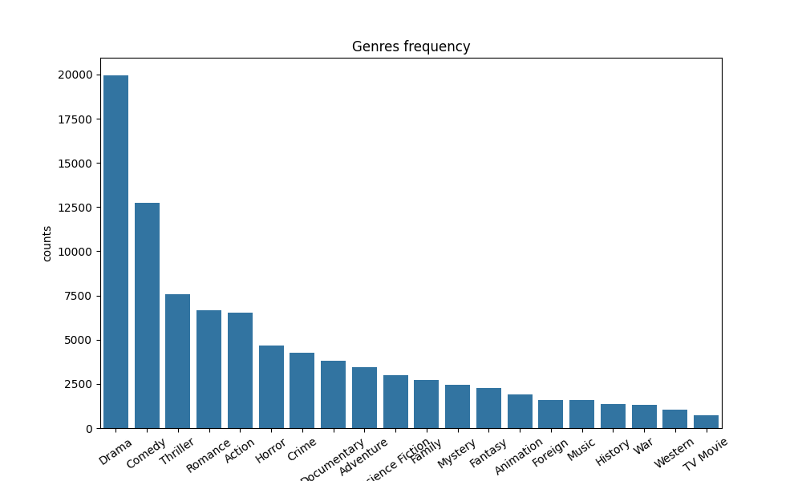

# Опис проекту

Скрипт аналізує дані про фільми з CSV-файлу `movies_metadata.csv` та візуалізує популярність жанрів.

## Ключові кроки

1. **Імпорт бібліотек**: `numpy`, `pandas`, `matplotlib`, `seaborn`, `ast`.
2. **Завантаження даних**: читає CSV, показує `head()`, `info()`, `describe()`, підраховує пропуски.
3. **Обробка пропусків**:  
   - `tagline` → `"without tagline"`  
   - `homepage` → `"no homepage"`  
   - `belongs_to_collection` → `"{}"`  
   - Видалення рядків з іншими пропусками.
4. **Обробка жанрів**: перетворює рядки зі словниками у списки жанрів, підрахунок частоти.
5. **Візуалізація**: барплот частоти жанрів з підписами та заголовком.

## Результат

- Таблична інформація про фільми.  
- Частота жанрів.  
- Графік популярних жанрів.
## Популярність жанрів

